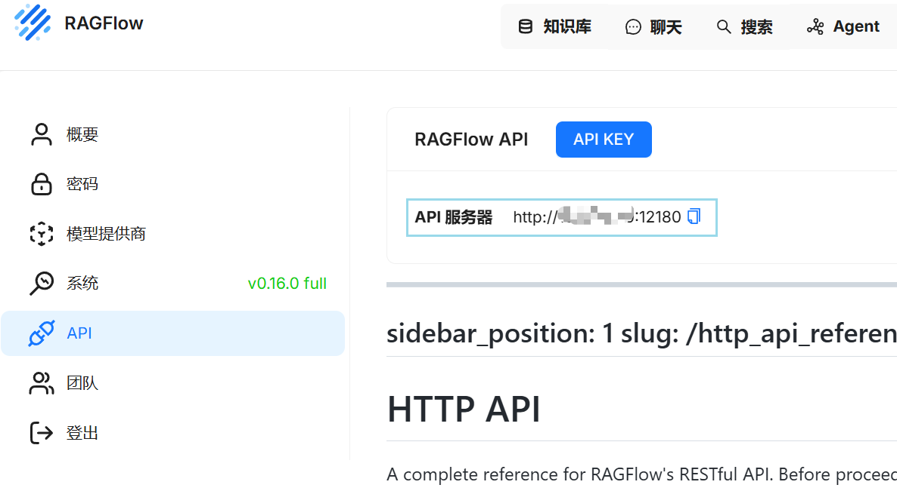
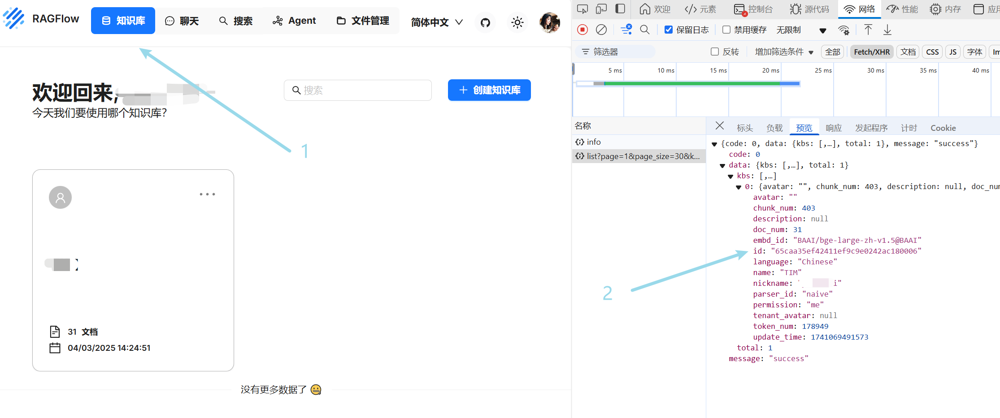

# External Datasets Service

[English](#english) | [中文](#中文)

<a name="english"></a>
## English

### Project Description
Dify External Datasets Service is a service that implements Dify's external knowledge base API, integrating with RagFlow knowledge base.

### Features
- Document retrieval based on knowledge base ID
- Configurable retrieval parameters (top_k, score_threshold)
- Bearer token authentication
- Error handling and standardized response format

### Prerequisites
1. Knowledge base created in RagFlow
2. API KEY generated in RagFlow
3. RagFlow API server address available


### Docker Compose Deployment
1. Create .env file
2. Configure environment variables
    ```bash
    # RagFlow API server address
    API_URL=http://127.0.0.1:12180
    ```
3. Start the service using docker-compose
    ```bash
    docker-compose up -d
    ```
4. The service will be available at `URL_ADDRESS:18121`

### Source Code Deployment
1. Clone the repository
2. Create .env file
3. Configure environment variables
    ```bash
    # RagFlow API server address
    API_URL=http://127.0.0.1:12180
    ```
4. Start the service
    ```bash
    go run main.go
    ```
5. The service will be available at `URL_ADDRESS:8080`

### API Usage
#### Retrieval Endpoint
- **URL**: `/retrieval`
- **Method**: POST
- **Headers**:
  - Content-Type: application/json
  - Authorization: Bearer <your-token>

- **Request Body**:
```json
{
    "knowledge_id": "your-knowledge-base-id",
    "query": "your search query",
    "retrieval_setting": {
        "top_k": 5,
        "score_threshold": 0.7
    }
}
```

- **Response**:
```json
{
    "records": [
        {
            "metadata": {
                "path": "document-url",
                "description": "document-name"
            },
            "score": 0.85,
            "title": "document-title",
            "content": "matched-content"
        }
    ]
}
```

### Adding External Knowledge Bases to Dify
1. Connect to External Knowledge Bases
2. How to get knowledge_id
    - Open the developer tools in RagFlow
    - Open the request interface (/v1/kb/list?page=1&page_size=30&keywords=)
    - View knowledge_id
  

<a name="中文"></a>
## 中文

### 项目描述
Dify External Datasets Service 是一个实现了 Dify 外部知识库 API 的服务，实现了接入 RagFlow 知识库。


### 功能特性
- 基于知识库 ID 的文档检索
- 可配置的检索参数（top_k, score_threshold）
- Bearer token 认证
- 错误处理和标准化响应格式

### 使用前准备
1. RagFlow 中已创建知识库
2. RagFlow 中已创建了API KEY
3. 查看 RagFlow Api 服务器地址


### docker-compose 部署
1. 创建 .env 文件
2. 配置环境变量
    ```bash
    # RagFlow Api 服务器地址
    API_URL=http://127.0.0.1:12180
    ```
3. 使用 docker-compose 启动服务
    ```bash
    docker-compose up -d
    ```
4. 服务将在 `URL_ADDRESS:18121` 上可用

### 源码启动服务
1. 克隆代码仓库
2. 创建 .env 文件
3. 配置环境变量
    ```bash
    # RagFlow Api 服务器地址
    API_URL=http://127.0.0.1:12180
    ```
4. 启动服务
    ```bash
    go run main.go
    ```
5. 服务将在 `URL_ADDRESS:8080` 上可用

### API 使用说明
#### 检索接口
- **接口地址**：`/retrieval`
- **请求方法**：POST
- **请求头**：
  - Content-Type: application/json
  - Authorization: `Bearer <your-token>`

- **请求体**：
```json
{
    "knowledge_id": "知识库ID",
    "query": "检索查询语句",
    "retrieval_setting": {
        "top_k": 5,
        "score_threshold": 0.7
    }
}
```

- **响应示例**：
```json
{
    "records": [
        {
            "metadata": {
                "path": "文档URL",
                "description": "文档名称"
            },
            "score": 0.85,
            "title": "文档标题",
            "content": "匹配内容"
        }
    ]
}
```

### Dify 中添加外部知识库
1. 连接外部知识库
见文档： [连接外部知识库](https://docs.dify.ai/zh-hans/guides/knowledge-base/connect-external-knowledge-base)
2. 如何获取 knowledge_id
   - 在 RagFlow 中打开开发人员工具
   - 在请求接口（/v1/kb/list?page=1&page_size=30&keywords=）中查看 knowledge_id。

